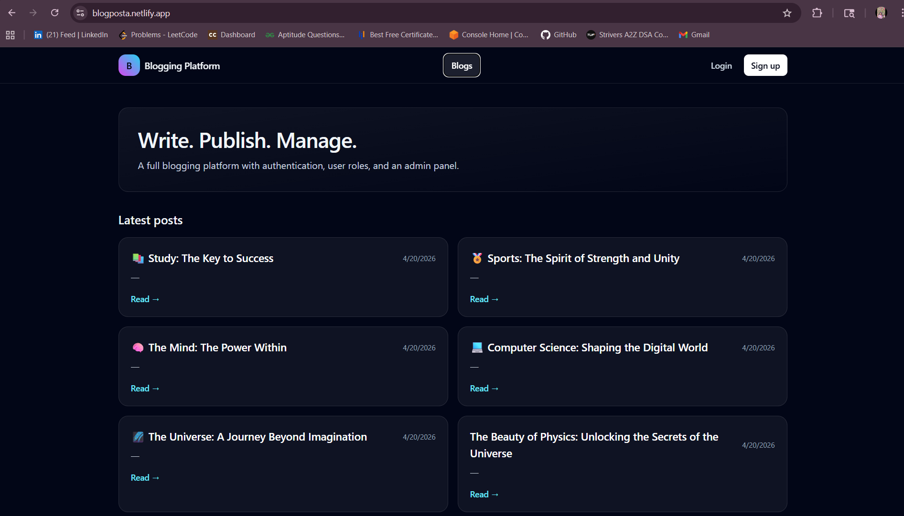
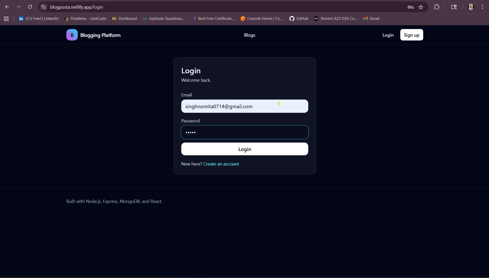
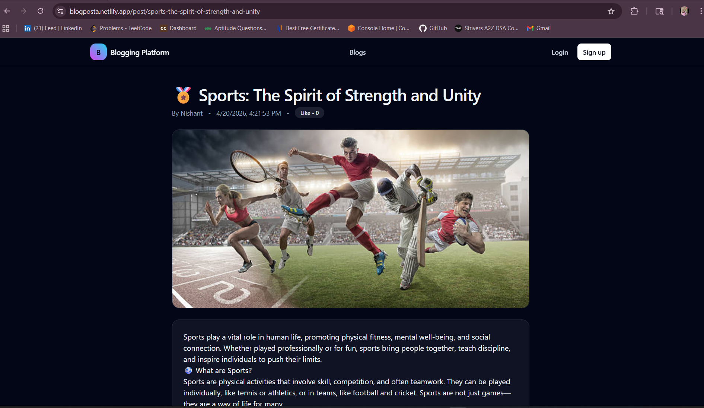

<<<<<<< HEAD
# Blogging Platform with Authentication and Admin Panel

## Tech
- Backend: Node.js, Express, MongoDB (Mongoose), JWT auth
- Frontend: React (Vite), Tailwind CSS, React Router

## Setup

### 1) Backend
From `blog_Platfom/backend`:

1. Create `.env` from `.env.example`
2. Start MongoDB (local or Atlas)
3. Install and run:

```bash
npm install
npm run dev
```

Create an admin user (optional):

```bash
npm run seed:admin
```

Default admin seed creds (if you don't override env vars):
- Email: `admin@example.com`
- Password: `admin12345`

### 2) Frontend
From `blog_Platfom/frontend`:

1. Create `.env` from `.env.example`
2. Install and run:

```bash
npm install
npm run dev
```

Open the app at `http://localhost:5173`.

## Features
- Authentication: signup, login, logout
- Roles: user & admin
- Blog: create/edit/delete posts (users manage their own)
- Admin panel: manage users, delete any post

## Team Work Division (5 members)
- **Member 1 — Backend lead (API + DB)**: Express setup, MongoDB models (`User`, `Post`), JWT auth, post CRUD APIs, role middleware.
- **Member 2 — Admin panel**: Admin dashboard UI, manage users (list/change role/delete), manage posts (view/delete), connect to backend.
- **Member 3 — User module**: Login/Signup UI, profile page, “My posts” page (edit/delete own), create/edit post editor.
- **Member 4 — Public blog UI**: Home feed, single post page, layout/navbar responsiveness, empty states, public API integration.
- **Member 5 — Testing & documentation**: E2E test checklist, seed/admin instructions, README, env variable guide, deployment plan.

## Deployment (Render + Vercel + MongoDB Atlas)

### Backend (Render)
- Push this project to GitHub.
- Render → **New** → **Blueprint** → select your repo (uses `render.yaml`).
- Set Render env vars:
  - **MONGODB_URI**: your MongoDB Atlas URI
  - **JWT_SECRET**: long random string
  - **CORS_ORIGIN**: your Vercel URL (example: `https://your-app.vercel.app`)
- After deploy, open Render Shell and run:

```bash
npm run seed:admin
```

### Frontend (Vercel)
- Vercel → **New Project** → import repo
- Root directory: `frontend`
- Add env var:
  - **VITE_API_URL**: `https://<your-render-backend>/api`
- Deploy


=======
# 📝 Blogging Platform

A full-stack **MERN Blogging Platform** with authentication and an admin portal.
Users can create, read, update, and delete blogs, while admins manage users and content.

---

## 🚀 Features

* 🔐 User Authentication (JWT-based login/register)
* 📝 Blog CRUD (Create, Read, Update, Delete)
* 👤 User Profiles
* 🛡️ Admin Dashboard
* 📂 Category-based Blogs
* ⚡ RESTful API Architecture

---

## 🗂️ Project Structure

```
blogging-platform/
│
├── .gitignore
├── .env.example
├── README.md
├── package.json
│
├── client/                     # React Frontend
│   ├── public/
│   └── src/
│       ├── components/         # Reusable UI components
│       ├── pages/
│       │   ├── admin/          # Admin dashboard pages
│       │   ├── auth/           # Login & Register
│       │   └── blog/           # Blog pages
│       ├── services/           # API calls (Axios)
│       ├── utils/              # Helper functions
│       └── App.js
│
└── server/                     # Express Backend
    ├── config/                 # Database configuration
    ├── controllers/            # Business logic
    │   ├── authController.js
    │   ├── blogController.js
    │   └── adminController.js
    ├── middleware/             # Authentication middleware
    │   ├── auth.js
    │   └── adminAuth.js
    ├── models/                 # Mongoose schemas
    │   ├── User.js
    │   ├── Post.js
    │   └── Category.js
    ├── routes/                 # API routes
    │   ├── auth.js
    │   ├── blog.js
    │   └── admin.js
    └── server.js               # Entry point
```

---

## ⚙️ Getting Started

### 📌 Prerequisites

* Node.js (v18 or above)
* MongoDB (Local or Atlas)

---

### 📥 Installation

```bash
# 1. Clone the repository
git clone https://github.com/nomita1303/BloggingPlatform.git

# 2. Navigate into project
cd BloggingPlatform

# 3. Setup environment variables
cp .env.example server/.env
```

👉 Edit `server/.env` and add:

```
MONGO_URI=your_mongodb_uri
JWT_SECRET=your_secret_key
PORT=5000
```

```bash
# 4. Install dependencies
npm run install:all

# 5. Start development servers
npm run dev
```

---

## 📜 Available Scripts

| Command               | Description                      |
| --------------------- | -------------------------------- |
| `npm run dev`         | Run client + server concurrently |
| `npm run server`      | Run backend only                 |
| `npm run client`      | Run frontend only                |
| `npm run install:all` | Install all dependencies         |

---

## 🔑 API Endpoints

### 🔐 Auth Routes

| Method | Endpoint             | Description   |
| ------ | -------------------- | ------------- |
| POST   | `/api/auth/register` | Register user |
| POST   | `/api/auth/login`    | Login user    |

---

### 📝 Blog Routes

| Method | Endpoint        | Description                 |
| ------ | --------------- | --------------------------- |
| GET    | `/api/blog`     | Get all posts               |
| GET    | `/api/blog/:id` | Get single post             |
| POST   | `/api/blog`     | Create post (Auth required) |
| PUT    | `/api/blog/:id` | Update post (Auth required) |
| DELETE | `/api/blog/:id` | Delete post (Auth required) |

---

### 🛡️ Admin Routes

| Method | Endpoint               | Description                |
| ------ | ---------------------- | -------------------------- |
| GET    | `/api/admin/users`     | Get all users (Admin only) |
| DELETE | `/api/admin/users/:id` | Delete user                |
| GET    | `/api/admin/posts`     | Get all posts              |

---

## 🛠️ Tech Stack

* **Frontend:** React, React Router, Axios
* **Backend:** Node.js, Express.js
* **Database:** MongoDB, Mongoose
* **Authentication:** JWT, bcryptjs

---

## 🌍 Environment Variables

Create a `.env` file inside `server/`:

```
MONGO_URI=your_mongodb_connection
JWT_SECRET=your_secret
PORT=5000
```

---

## 🤝 Contributing

1. Fork the repository
2. Create your branch (`git checkout -b feature/your-feature`)
3. Commit changes (`git commit -m "Add feature"`)
4. Push to branch (`git push origin feature/your-feature`)
5. Open a Pull Request

---

## 📄 License

This project is licensed under the **MIT License**.

## 🌐 Live Demo

🚀 The application is live and hosted on Render:
    https://blogposta.netlify.app/
### 📌 Description
This is a full-stack blogging platform where users can:
- Sign up and log in securely (JWT Authentication)
- Create, edit, and delete blog posts
- Like and comment on posts
- Access admin dashboard features

> ⏳ Note: Initial load may take 30–60 seconds due to free hosting.    

## 📸 Screenshots

### 🏠 Home Page


### 🔐 Login Page


### 📰 Blog List Page


---

---
>>>>>>> 6218f10ab0f2de633580e856d563b128efdd5ce1
